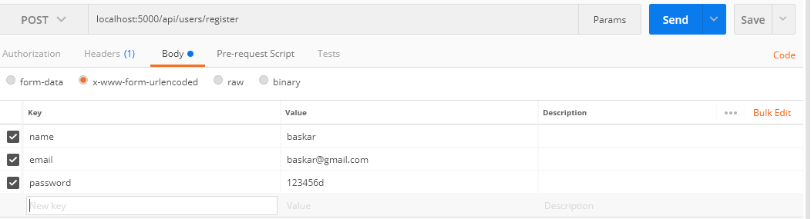
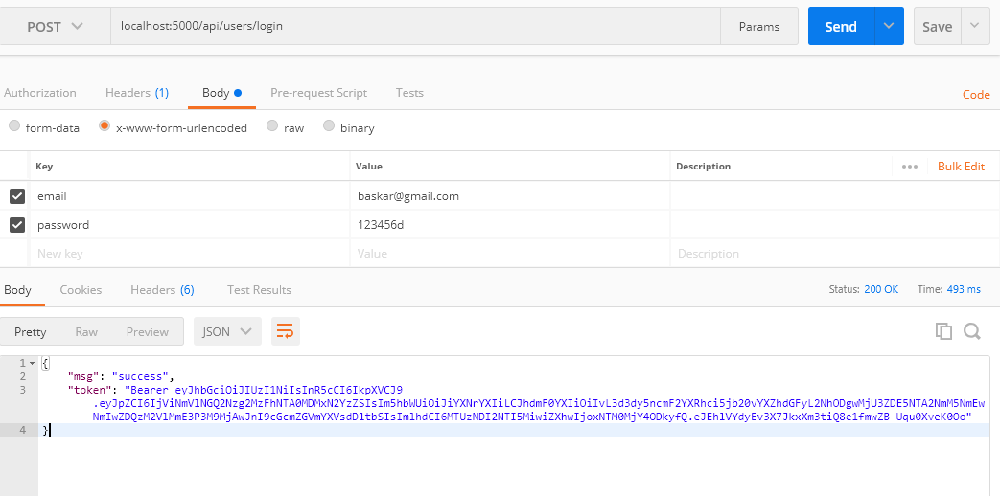
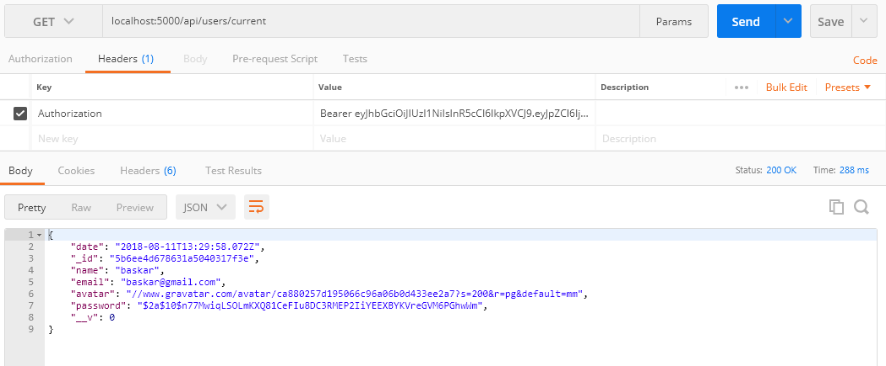

# nodejs-mongodb-passport-jwt-login
passport based login using jwt node.js

1.open terminal and npm install

2.open ./config/keys.js

3.edit Mongodb url and save it

4.run nodemon server and server starts at port 5000

5.open postman

6.Create post request to register the user which returns all entries of the user in the collection

7.Now create post request to login, which returns Json token

8.Now create post request to make use of jwttoken which returns users information 

